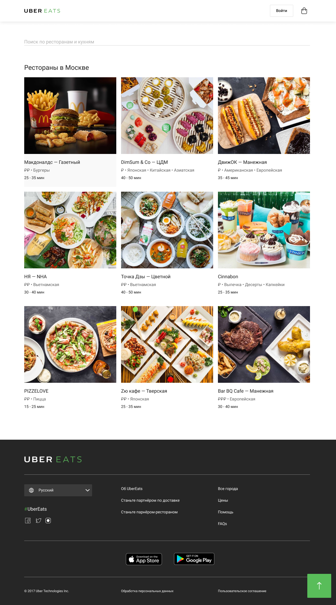
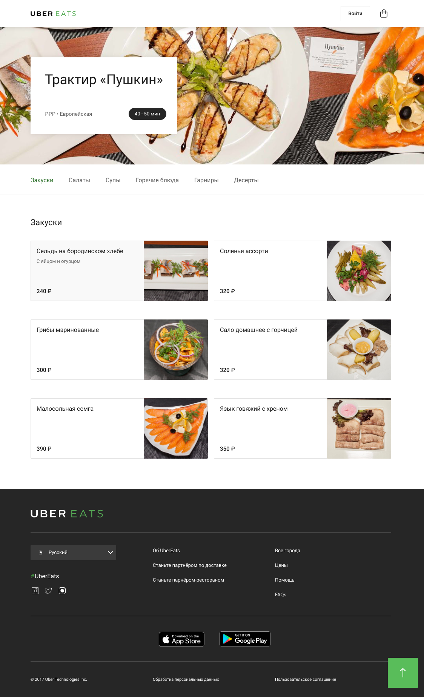

### Выпускной проект.

Курс на stepik.org - [Веб-разработка для начинающих: HTML и CSS](https://stepik.org/course/38218/syllabus).

Верстка и адаптация сайта Uber Eats под разные устройства, из макета на [Фигме](https://www.figma.com/file/8lxQ3PGYTHQsCgTXnEJre8/Uber-Eats).

>Сайт состоит из двух страниц – списка ресторанов и страницы ресторана.
Страницы связаны друг с другом ссылками – клик по любому ресторану из списка,
переносит на страницу с рестораном «Пушкин».

   

В верстке были использованы сборщик [Gulp](https://gulpjs.com/),
препророцессор [Sass](https://sass-lang.com/) и немного блочной верстки по методологии [БЕМ](https://ru.bem.info/methodology/).

Использовалась сборка [Александра Мальцева](https://itchief.ru/bootstrap/build-project-with-gulp-v4), немного модифицирована под мои потребности.)

Сорцы с блоками кода лежат в папке `src`.
Результат сборки, файлы лежат в папке `dist`.

### Для тех, кто хочет потестировать сборку и покликать сайт, нужно предварительно установить.
* Для сборки и редактирования шаблона у вас должен быть установлен [nodejs](https://nodejs.org/).
* Так же установите Gulp, можно глобально: `npm install --global gulp`.
* Дальше установите необходимые независимости: `npm i`.
* И теперь можно запустить сам проект командой в консоли: `gulp`.

Если все сделали правильно, то автоматически все соберется, и запуститься браузер с главной страницей сайта.)
